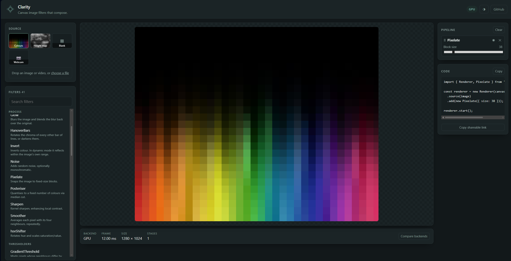

Clarity
=======

Fifty-two composable image filters for canvas — blur, edge detection, chromatic
aberration, posterising, normal maps, motion detection — running as fragment
shaders by default, with a CPU implementation of every one of them behind it.

Every filter takes `ImageData` and returns `ImageData`, so they compose by
chaining. You never write a shader, manage a context, or touch a framebuffer.

**[Open the playground →](https://clarity.clarklavery.com/)**

[](https://clarity.clarklavery.com/)

Stack filters, point it at an image or your webcam, and watch it run. The chain
lives in the URL, so any stack you build is a link you can send:

- [Colour bleed and chromatic aberration](https://clarity.clarklavery.com/#books/Bleed,radius=24/ChromaticAberration,xdistance=16) — the composite-video look
- [Posterised to six colours](https://clarity.clarklavery.com/#landscape/Posteriser,colours=6) — median-cut palette, per frame
- [A cloud texture from nothing](https://clarity.clarklavery.com/#blank/Cloud,iterations=6) — the starters need no input at all
- [Height map to normal map](https://clarity.clarklavery.com/#heightmap/NormalGenerator) — then [flipped and re-lit](https://clarity.clarklavery.com/#heightmap/NormalGenerator/NormalIntensity)
- [Speckle eaten without moving the edges that remain](https://clarity.clarklavery.com/#rorschach/Morphology,mode=open,radius=3) — open, then [close](https://clarity.clarklavery.com/#rorschach/Morphology,mode=close,radius=3) to fill the gaps instead
- [Scrambled like a puzzle](https://clarity.clarklavery.com/#books/Puzzler,horizontalSegs=8,verticalSegs=6)
- [A CRT](https://clarity.clarklavery.com/#landscape/FishEye,amount=0.35/HanoverBars,mode=scanlines/Vignette,amount=0.7,radius=0.4,softness=0.7) — which is not a filter but three of them: a lens curve, scanlines, and a corner falloff

Why you might want it
---------------------

- **The GPU path is the default, not an add-on.** An N-filter chain is N draw
  calls with no CPU round-trip between them. Where there's no WebGL2 it falls
  back silently, per stage rather than all-or-nothing.
- **CSS can't do most of these.** `filter: blur()` already covers blur and
  saturation, and does it better. Clarity is for the ones the platform has no
  answer for — chromatic aberration, colour bleed, posterising, normal
  generation, motion and difference detection, puzzling.
- **Filters describe themselves.** Each carries a schema of its properties, so
  a host app can build controls for filters it has never heard of. Clarity
  ships no UI code at all.
- **Chains are text.** `'Blur,radius=8/Invert'` round-trips through a URL, a
  data attribute or a saved preset.
- **No dependencies, no DOM requirement.** It runs in Node against a plain
  `ImageData`, which is how its own test suite works.

Install
-------

```sh
npm install @calrk/clarity
```

Usage
-----

A single filter is a function from `ImageData` to `ImageData`. If that is all
you need, that is all there is:

```js
import { Blur } from '@calrk/clarity';

const frame = ctx.getImageData(0, 0, canvas.width, canvas.height);
ctx.putImageData(new Blur({ radius: 8 }).process(frame), 0, 0);
```

For anything moving, `Renderer` owns the canvas, the source, the ordered chain
and the frame loop — and puts the whole stack on the GPU:

```js
import { Renderer, Blur, EdgeDetector, Invert } from '@calrk/clarity';

const renderer = new Renderer(canvas)
	.source(video)
	.add(new Blur({ radius: 8 }))
	.add(new EdgeDetector({ fast: true }))
	.add(new Invert());

renderer.start();
```

`source()` takes an image, a video, a canvas or a webcam stream. `start()` runs
a `requestAnimationFrame` loop; `render()` does one frame. `move(from, to)`,
`insert`, `remove` and `clear` reorder the chain live, mid-playback.

Each filter takes a typed options bag, exposes `enabled` to bypass it without
removing it from the chain, and describes its own tweakable properties through a
[schema](#property-schemas). The two-input filters (`Add`, `Subtract`, `Blend`,
`Mask`, `Multiply`) take `process([frameA, frameB])`.

A plain `<script>` build is also published, exposing everything on a `CLARITY`
global:

```html
<script src="dist/clarity.global.js"></script>
<script>
	const blur = new CLARITY.Blur({ radius: 8 });
</script>
```

GPU
---

**Shaders are the default.** A `Pipeline` creates a WebGL2 context on first use
and runs every filter that has a shader as a fragment shader, ping-ponging two
framebuffers so an N-filter chain is N draw calls with no CPU round-trip in
between. Where WebGL2 is missing — Node, an old browser, a lost context — it
falls back to the CPU silently.

```js
const pipeline = new Pipeline([new Desaturate(), new EdgeDetector()]);
pipeline.usingGPU;            // false when WebGL2 could not be had
pipeline.run(frame);
pipeline.stats.backend;       // 'gpu' | 'cpu' | 'mixed'
pipeline.stats.fallbacks;     // which stages ran on the CPU, and why
pipeline.stats.transfers;     // times the frame crossed between the two

new Pipeline(filters, { gpu: false });   // opt out
```

**Every filter has a shader**, so in a browser the whole chain runs on the GPU.
Fallback is still **per stage** rather than all-or-nothing, for the cases where
a shader can't compile or a filter's options aren't covered: one stage dropping
to the CPU doesn't drag the rest with it. Each maximal run of shader stages is
uploaded once, ping-ponged through, and read back once.

The CPU implementation stays the reference. It's the oracle the parity tests
compare against and the fallback when there's no GL, so a filter isn't finished
until both paths exist and agree — `npm run test:gpu` runs every case through
both and compares.

### Writing a shader

A filter declares one, compiled against a prelude that supplies the source
texture, the frame size, the channel selector and a `u_<key>` uniform per schema
property:

```js
class Invert extends Filter {
	static shader = `
		void main(){
			writeRGB(vec3(255.0) - srcPixel(vUv).rgb);
		}
	`;
}
```

Colours are handled in **0–255 space**, matching what the CPU implementations
compare against. `static supportsGPU(filter)` says when a shader covers only
some of the filter's options; an array of passes handles the multi-draw cases.

A pass may also declare a `reduce` shader, for filters that need to know
something about the whole frame first. It maps each pixel to the quantity being
reduced; a pyramid of halving passes collapses that to one texel, which the
filter reads back with `reduction()` as (min, max). That is how `Invert`'s
dynamic mode, `Contourer` and `ValueThreshold`'s auto mode get the frame's range
without a readback.

Four more hooks cover what a plain fragment shader can't reach. Each is a
`static` on the filter:

| | for | in the shader |
|---|---|---|
| `outputSize` | a filter that changes the frame's size — `Rotator` | `uOutSize` |
| `retains` | previous frames — `Ghoster`, `MotionDetector` | `historyTexel(age, p)` |
| `data` | per-instance arrays — `Puzzler`'s shuffle | `dataTexel(x, y)` |
| `samples` + `prepare` | whole-image statistics — `Posteriser`'s palette | via `data` |

`samples` is the interesting one. A filter that must see every pixel before it
can decide anything — a median-cut palette, a set of quartiles — asks for a
small point-sampled copy, and `prepare` is handed it before the shader runs.
That is a thumbnail rather than the frame, so it costs about 1% of a readback.
The CPU path calls the same `prepare` with the same sample, so both backends
derive their answer from identical pixels.

Filters needing an earlier pass's input declare nothing — a shader mentioning
`uOriginal` gets the stage's input stashed aside for it automatically.

Pipelines
---------

`Pipeline` is the headless half of `Renderer` — an ordered filter list with no
canvas, no DOM and no frame loop. Use it directly outside the browser, or as the
chain behind your own render loop:

```js
const pipeline = new Pipeline([new Desaturate(), new ValueThreshold({ threshold: 120 })]);
const out = pipeline.run(frame);
```

It only recomputes what can have changed. Everything upstream of the first stage
that is dirty, impure or newly reordered comes out of a cache, so tweaking the
last filter in a long chain doesn't redo the ones before it — and an unchanged
chain on an unchanged frame does no work at all. `pipeline.stats` reports where
the time went and how many stages were skipped.

That requires knowing which filters are safe to cache, so each declares itself:

- `static stateful` — output depends on frames already seen (`Ghoster`,
  `MotionDetector`, `DifferenceDetector`). Must see every frame, in order.
- `static varying` — output changes between calls on identical input, because
  the filter reads the clock or the random source (`Wave`, `Noise`, `Cloud`).

Neither is ever cached. Everything else is pure and is.

A stateful filter's history is thrown away — `reset()` — whenever it stops
being trustworthy: the chain is edited, the filter is removed, one of its
properties changes, or it moves between the CPU and the GPU. That last one
matters because the two keep separate histories, and blending them makes a
trail jump.

### Two-input filters

`Add`, `Subtract`, `Blend`, `Mask` and `Multiply` need a second frame, which a
stage supplies:

```js
const maskChain = new Pipeline([new Desaturate(), new ValueThreshold()]);

new Pipeline()
	.add(new Blur({ radius: 6 }))
	.add(new Mask(), { second: maskChain });
```

`second` takes an `ImageData`, a function returning one, or another `Pipeline` —
which is fed the outer run's *source*, so it branches off the input rather than
continuing the chain.

Filtering an ``
--------------------

```svelte
<script>
	import { clarity } from '@calrk/clarity/svelte';
</script>


```

The element keeps its identity - same ``, same CSS, same `alt` - and only
its `src` changes. The original path is kept on `data-clarity-source`, so the
effect reverts cleanly, re-runs against the untouched original whenever the
chain changes, and can be read back by anything else on the page.

It's a Svelte *action*, but it's a plain function with no Svelte import, so it
works in Svelte 4 and 5, in other frameworks, and on its own:

```js
const handle = clarity(document.querySelector('img'), 'Blur,radius=8');
handle.update('Invert');   // re-runs from the original
handle.destroy();          // puts the src back
```

Options instead of a bare string:

```js
clarity(img, {
	chain: 'Glow,radius=12',
	enabled: !reducedMotion,     // false reverts without unmounting
	hide: true,                  // hide until the result is ready
	crossOrigin: 'anonymous',    // see below
	onError: (error) => ...      // otherwise it warns and reverts
});
```

Two things worth knowing. Every element shares **one** WebGL context - a browser
hands out about sixteen before it starts dropping the oldest, so a context per
sprite breaks quietly. And reading pixels from a **cross-origin** image taints
the canvas, which is the likeliest way this fails in a real app since game
assets tend to live on a CDN: it needs `crossOrigin` here *and* an
`Access-Control-Allow-Origin` header from the server.

### Chains as text

The `'Blur,radius=8/Invert'` format is the library's, not the adapter's:

```js
import { buildChain, formatChain, FILTERS } from '@calrk/clarity';

buildChain('Desaturate/Blur,radius=8/Invert!off');   // => Filter[]
formatChain(pipeline.filters);                       // => string
FILTERS.Blur;                                        // name -> constructor
```

Filters are separated by `/`, properties by `,`, and `!off` bypasses one.
Reading is deliberately forgiving - an unknown filter or property is skipped
rather than thrown, because the text usually comes from a URL or an attribute
written against some other version - and only properties that differ from their
default are written, so the string stays short and stays valid when a default
changes. It's what the playground puts in its address bar.

Property schemas
----------------

Every filter carries a `static schema` describing its properties — what each one
means, and what values are legal:

```js
Blur.schema
// { radius: { type: 'int', label: 'Radius', min: 1, max: 180, step: 1, default: 10 } }
```

Clarity ships **no UI code**. The schema is metadata, so build controls however
you like — `site/src/controls.js` is a ~130-line plain-DOM renderer that handles
every filter in the library, and a framework version is shorter still:

```svelte
{#each Object.entries(filter.schema) as [key, field]}
	<label>{field.label}</label>
	{#if field.type === 'bool'}
		<input type="checkbox" checked={filter.getProperty(key)}
			on:change={(e) => filter.setProperty(key, e.target.checked)}>
	{:else}
		<input type="range" min={field.min} max={field.max} step={field.step}
			value={filter.getProperty(key)}
			on:input={(e) => filter.setProperty(key, e.target.value)}>
	{/if}
{/each}
```

Always write through `setProperty`. It coerces per the schema, clamps to the
declared range, and rebuilds any derived state — a DOM input hands back a
*string*, so assigning to `properties` directly leaves you with `radius: "10"`,
which works in some arithmetic and silently breaks the rest.

Field types are `int`, `float`, `bool` and `select`. A numeric field may be
`nullable`, meaning `null` is legal and stands for "derive this from the frame"
— `ValueThreshold`'s auto mode is the one that uses it.

### Outside the browser

Clarity has no DOM dependency at all. Node has no global `ImageData` though, so
headless callers must supply one:

```js
import { setImageDataFactory } from '@calrk/clarity';

setImageDataFactory((w, h) => new MyImageData(w, h));
```

Development
-----------

```sh
npm install
npm run dev        # the playground, with the library loaded from source
npm run build      # emits dist/ (ESM + UMD + global) and .d.ts files
npm run typecheck
npm test
```

`dist/` is generated and not committed - the tests run against it, so run
`npm run build` once after cloning.

### Playground

`site/` is the single-page playground live at
**[clarity.clarklavery.com](https://clarity.clarklavery.com/)**: pick a source,
drag filters into a chain, and watch it run. It is also the demo, so it doubles
as the answer to "what does this library actually do".

```sh
npm run site           # dev server, library loaded from src/ rather than dist/
npm run site:build     # static build into site/dist
npm run deploy         # build, then wrangler deploy to Cloudflare
```

It builds nothing the library does not already expose: the palette comes from
`CATALOGUE`, the controls from each filter's schema, the code panel from the
chain itself. That is the test of whether the metadata is any good - if a new
filter needs the playground edited, the metadata was not enough.

Chains live in the URL - `#photo/Blur,radius=8/Invert` - so a link reproduces an
exact stack. A dropped file joins the source list for the session; nothing is
uploaded anywhere, so it only exists in that tab.

Deployment is an assets-only Cloudflare Worker (`wrangler.jsonc`), so there is
no server code — a push to `main` builds and ships it. `npm run deploy` does the
same thing by hand.

### Tests

Filter output is pinned by golden images in `test/golden/`, one per case,
compared exactly. Filters that use randomness or time take injectable `random`
and `now` options so their output is reproducible:

```js
import { Noise, seededRandom } from '@calrk/clarity';

new Noise({ intensity: 40, random: seededRandom(1) });   // same result every run
```

```sh
npm run test:golden           # goldens only
npm run test:gpu              # every case through both backends, compared
npm run test:action           # the  action, in a real browser
npm run test:update-golden    # regenerate them, then review the diff before committing
npm run test:fixtures         # regenerate the input images in test/fixtures/
npm run test:sheet            # build the contact sheet (below)
```

The browser-driven suites - GPU parity, the playground and the `` action -
need Chrome, and skip cleanly when there isn't one. They run it headless with
SwiftShader, so they need no GPU and work in CI.

When a golden fails, the actual output and a visual diff are written to
`test/output/`. Never regenerate a golden to make a test pass without looking at
what changed.

### Contact sheet

`npm run test:sheet` builds `test/contact-sheet/index.html` - a single
self-contained page showing every filter's input and output side by side, with
what each filter does and what you should be able to see. Each card reports the
percentage of pixels the filter actually changed, and any filter that changed
*nothing* is highlighted, which is the quickest way to spot one that has
silently stopped working.

Open it in a browser after `npm run build && npm run test:update-golden`.

Licence
-------

**MIT** - see [LICENSE](LICENSE).

The one remaining piece of third-party code is `src/vendor/StackBlur.js`, by
Mario Klingemann, which is also MIT. Its copyright notice is reproduced in
LICENSE and is baked into every built bundle.

Filters
=======

54 of them, in eight families. The **[full reference](docs/FILTERS.md)**
gives each one a before/after image, an options table and a live playground link -
generated from the library by `npm run docs`, and checked by the test suite, so it
cannot describe a filter that no longer works that way.

| Family | Filters |
|---|---|
| Process | `Bleed`, `Blur`, `ChromaKey`, `Convolver`, `Desaturate`, `Dither`, `DotCrawl`, `Glow`, `GradientMap`, `Halftone`, `HanoverBars`, `Histogram`, `Invert`, `Levels`, `Morphology`, `Noise`, `Pixelate`, `Posteriser`, `Vignette`, `hsvShifter` |
| Thresholders | `GradientThreshold`, `MedianThreshold`, `ValueThreshold` |
| Salience | `EdgeDetector`, `MotionDetector`, `ShotDetector`, `SkinDetector` |
| Transform | `ChromaticAberration`, `FishEye`, `Mirror`, `Rotator`, `Tiler`, `Translator`, `Wave` |
| Height Map | `Contourer`, `NormalFlip`, `NormalGenerator`, `NormalIntensity` |
| Starters | `Cloud`, `Fill`, `Gradient`, `Voronoi`, `Woodgrain` |
| Dual Input | `Add`, `Subtract`, `Difference`, `Blend`, `Mask`, `Multiply` |
| Misc | `Brickulate`, `DifferenceDetector`, `Ghoster`, `ScreenBurn`, `Puzzler` |

Filters to be made
==================

Tracked in [FEATURES.md](FEATURES.md) #9, which carries the same list plus an
effort rating and the dependencies between them - a custom 3x3 kernel makes
Sobel, Laplace and Emboss into presets rather than files, so it goes first.

Other things to work on
=======================

Now tracked properly in [FEATURES.md](FEATURES.md), which covers the GPU/shader
backend, the renderer object, the dirty-flag skip, and the rest - each grounded
in the code with an effort rating and a priority order.