# Clarity — Filter Reference

**Generated by `npm run docs`. Do not edit.** Every summary, option, range and
description here comes from the library itself, and the pictures are the golden
images the test suite asserts against — so this page cannot describe a version
of a filter that does not exist.

49 filters. Each links into the [playground](https://clarity.clarklavery.com/), where the
chain in the address bar is the same text the library parses.

The images are the test fixtures, which are 64×48 so the goldens stay small and
diffable — they show the shape of an effect, not its quality. Follow the
playground link to see one at a sensible size.

## Contents

**Process** — [Bleed](#bleed) · [Blur](#blur) · [Convolver](#convolver) · [Desaturate](#desaturate) · [DotCrawl](#dotcrawl) · [Glow](#glow) · [HanoverBars](#hanoverbars) · [Invert](#invert) · [Levels](#levels) · [Morphology](#morphology) · [Noise](#noise) · [Pixelate](#pixelate) · [Posteriser](#posteriser) · [Vignette](#vignette) · [hsvShifter](#hsvshifter)

**Thresholders** — [GradientThreshold](#gradientthreshold) · [MedianThreshold](#medianthreshold) · [ValueThreshold](#valuethreshold)

**Salience** — [EdgeDetector](#edgedetector) · [MotionDetector](#motiondetector) · [ShotDetector](#shotdetector) · [SkinDetector](#skindetector)

**Transform** — [ChromaticAberration](#chromaticaberration) · [FishEye](#fisheye) · [Mirror](#mirror) · [Rotator](#rotator) · [Tiler](#tiler) · [Translator](#translator) · [Wave](#wave)

**Height Map** — [Contourer](#contourer) · [NormalFlip](#normalflip) · [NormalGenerator](#normalgenerator) · [NormalIntensity](#normalintensity)

**Starters** — [Cloud](#cloud) · [FillHSV](#fillhsv) · [FillRGB](#fillrgb) · [Gradient](#gradient) · [Voronoi](#voronoi)

**Dual Input** — [Add](#add) · [Subtract](#subtract) · [Difference](#difference) · [Blend](#blend) · [Mask](#mask) · [Multiply](#multiply)

**Misc** — [Brickulate](#brickulate) · [DifferenceDetector](#differencedetector) · [Ghoster](#ghoster) · [ScreenBurn](#screenburn) · [Puzzler](#puzzler)

## What the badges mean

| Badge | Meaning |
|---|---|
| **Starter** | Ignores its input and generates a frame, so it belongs at the head of a chain. |
| **Two inputs** | Needs a second frame as well as the one flowing through the pipeline. |
| **Needs motion** | Compares frames over time. On a still image it has nothing to compare and outputs black. |
| **Wants a height map** | Reads brightness as height, so it expects a greyscale height map rather than a picture. |
| **Wants a normal map** | Reads the channels as an XYZ vector, so it expects a normal map - run NormalGenerator first. |
| **Makes black & white** | Outputs two tones, which is what the filters wanting black and white are waiting for. |

## Process

### Bleed

Blurs a single channel, so colour bleeds out of its edges.

 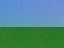

[Open in the playground →](https://clarity.clarklavery.com/#landscape/Bleed,radius=6)

```js
import { Bleed } from '@calrk/clarity';

new Bleed({ radius: 6 });
```

| Property | Type | Range | Default | |
|---|---|---|---|---|
| `radius` | int | 1–180 | `10` | How far the colour smears. Detail is unaffected. |

### Blur

Stack blur - a fast Gaussian approximation.

 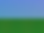

[Open in the playground →](https://clarity.clarklavery.com/#landscape/Blur,radius=6)

```js
import { Blur } from '@calrk/clarity';

new Blur({ radius: 6 });
```

| Property | Type | Range | Default | |
|---|---|---|---|---|
| `radius` | int | 1–180 | `10` | Radius of the blur, in pixels. |

### Convolver

Convolves a 3x3 kernel over the frame - sharpen, smooth, emboss, or edges by Sobel or Laplace.

 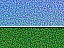

[Open in the playground →](https://clarity.clarklavery.com/#books/Convolver)

```js
import { Convolver } from '@calrk/clarity';

new Convolver();
```

| Property | Type | Range | Default | |
|---|---|---|---|---|
| `preset` | select | `smooth` · `sharpen` · `sobel` · `laplace` · `emboss` | `sharpen` | Which 3x3 matrix to convolve with. Sobel is the magnitude of two perpendicular ones. |
| `amount` | float | 0–3 | `1` | Blends the result back over the original. 0 does nothing, 1 is the plain kernel, above 1 overshoots. |
| `iterations` | int | 1–5 | `1` | How many times to run the kernel, each pass over the last output. |

### Desaturate

Pulls colour towards grey, by an amount, keeping luminance.

 

[Open in the playground →](https://clarity.clarklavery.com/#landscape/Desaturate)

```js
import { Desaturate } from '@calrk/clarity';

new Desaturate();
```

| Property | Type | Range | Default | |
|---|---|---|---|---|
| `amount` | float | 0–1 | `1` | How far towards grey. 1 removes colour entirely. |

### DotCrawl

The crawling dot pattern composite video leaves along colour edges.

 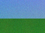

[Open in the playground →](https://clarity.clarklavery.com/#landscape/DotCrawl)

```js
import { DotCrawl } from '@calrk/clarity';

new DotCrawl();
```

| Property | Type | Range | Default | |
|---|---|---|---|---|
| `intensity` | float | 0–2 | `0.5` | How strong the dots are, as a multiple of the colour difference they sit on. |
| `speed` | float | 0–30 | `8` | How many times a second the pattern steps. 0 freezes it. |

### Glow

Blurs the image and blends the blur back over the original.

 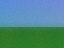

[Open in the playground →](https://clarity.clarklavery.com/#landscape/Glow,radius=6)

```js
import { Glow } from '@calrk/clarity';

new Glow({ radius: 6 });
```

| Property | Type | Range | Default | |
|---|---|---|---|---|
| `radius` | int | 1–180 | `10` | Radius of the blur that is blended back over the original. |

### HanoverBars

Rotates the chroma of every other bar of lines, or darkens them.

 

[Open in the playground →](https://clarity.clarklavery.com/#landscape/HanoverBars)

```js
import { HanoverBars } from '@calrk/clarity';

new HanoverBars();
```

| Property | Type | Range | Default | |
|---|---|---|---|---|
| `mode` | select | `hanover` · `scanlines` | `hanover` | Hanover rotates the chroma of alternate line pairs; scan lines darkens them. |
| `width` | int | 1–32 | `2` | Lines per bar. The pattern repeats every twice this. |
| `vertical` | bool | true / false | `false` | Bars down the frame rather than across it. |

### Invert

Inverts colour. In dynamic mode it reflects within the image's own range.

 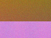

[Open in the playground →](https://clarity.clarklavery.com/#landscape/Invert)

```js
import { Invert } from '@calrk/clarity';

new Invert();
```

| Property | Type | Range | Default | |
|---|---|---|---|---|
| `dynamic` | bool | true / false | `false` | Reflects within the image own range rather than around 128. |
| `channel` | select | `grey` · `red` · `green` · `blue` | `grey` | Which channel to read. Grey is Rec. 601 luma of all three. |

### Levels

Remaps the black point, white point and gamma - the everyday contrast control.

 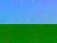

[Open in the playground →](https://clarity.clarklavery.com/#landscape/Levels,black=40,white=210)

```js
import { Levels } from '@calrk/clarity';

new Levels({ black: 40, white: 210 });
```

| Property | Type | Range | Default | |
|---|---|---|---|---|
| `black` | int | 0–255 | `0` | Everything this dark or darker becomes black. |
| `white` | int | 0–255 | `255` | Everything this bright or brighter becomes white. |
| `gamma` | float | 0.1–5 | `1` | Midtones only: above 1 brightens, below 1 darkens, and both ends stay put. |

### Morphology

Grows or shrinks light regions; open and close remove speckle without moving the edges that remain.

 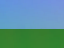

[Open in the playground →](https://clarity.clarklavery.com/#rorschach/Morphology,radius=2)

```js
import { Morphology } from '@calrk/clarity';

new Morphology({ radius: 2 });
```

| Property | Type | Range | Default | |
|---|---|---|---|---|
| `mode` | select | `dilate` · `erode` · `open` · `close` | `dilate` | Dilate grows light regions, erode shrinks them. Open removes small light specks, close fills small dark holes, and neither moves the edges that survive. |
| `radius` | int | 1–20 | `1` | How far the effect reaches, in pixels. Bigger removes bigger specks and spreads further. |

### Noise

Adds random noise, optionally monochromatic.

 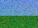

[Open in the playground →](https://clarity.clarklavery.com/#landscape/Noise,intensity=40)

```js
import { Noise } from '@calrk/clarity';

new Noise({ intensity: 40 });
```

| Property | Type | Range | Default | |
|---|---|---|---|---|
| `intensity` | float | 0–100 | `1` | Largest amount a channel can be pushed up or down. |
| `monochromatic` | bool | true / false | `false` | Move all three channels together, so the grain is grey rather than coloured. |

### Pixelate

Snaps the image to fixed-size blocks.

 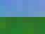

[Open in the playground →](https://clarity.clarklavery.com/#books/Pixelate,size=8)

```js
import { Pixelate } from '@calrk/clarity';

new Pixelate({ size: 8 });
```

| Property | Type | Range | Default | |
|---|---|---|---|---|
| `size` | int | 1–256 | `64` | Side of each block, in pixels. Every block takes the colour of its centre. |

### Posteriser

Quantises to a fixed number of colours via median cut.

 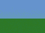

[Open in the playground →](https://clarity.clarklavery.com/#books/Posteriser,colours=6)

```js
import { Posteriser } from '@calrk/clarity';

new Posteriser({ colours: 6 });
```

| Property | Type | Range | Default | |
|---|---|---|---|---|
| `colours` | int | 1–20 | `5` | Palette size. Ignored by the fast method. |
| `method` | select | `median` · `fast` | `median` | Median cut derives a palette from the image; fast snaps to fixed bands. |

### Vignette

Darkens towards the corners.

 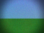

[Open in the playground →](https://clarity.clarklavery.com/#landscape/Vignette)

```js
import { Vignette } from '@calrk/clarity';

new Vignette();
```

| Property | Type | Range | Default | |
|---|---|---|---|---|
| `amount` | float | 0–1 | `0.6` | How dark it gets at the outside. 1 is black. |
| `radius` | float | 0–1.5 | `0.5` | Where the darkening starts, with 1 being the corner. |
| `softness` | float | 0–1.5 | `0.5` | How far it takes to fade in. Zero gives a hard circle. |

### hsvShifter

Rotates hue and scales saturation/value.

 

[Open in the playground →](https://clarity.clarklavery.com/#landscape/hsvShifter,hue=120,saturation=1.4,value=0.9)

```js
import { hsvShifter } from '@calrk/clarity';

new hsvShifter({ hue: 120, saturation: 1.4, value: 0.9 });
```

| Property | Type | Range | Default | |
|---|---|---|---|---|
| `hue` | float | 0–360 | `0` | Rotation in degrees. |
| `saturation` | float | 0–2 | `1` | Multiplies saturation. 0 is greyscale, 1 leaves it alone. |
| `value` | float | 0–2 | `1` | Multiplies brightness. 1 leaves it alone. |

## Thresholders

### GradientThreshold

Marks pixels whose neighbours differ by more than a threshold - edge detection by another route.

**Makes black & white**

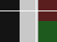 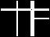

[Open in the playground →](https://clarity.clarklavery.com/#books/GradientThreshold,threshold=30)

```js
import { GradientThreshold } from '@calrk/clarity';

new GradientThreshold({ threshold: 30, distance: 1 });
```

| Property | Type | Range | Default | |
|---|---|---|---|---|
| `threshold` | float | 0–100 | `20` | How much neighbouring pixels must differ to be marked. |
| `distance` | int | 1–10 | `1` | How far away the compared neighbour is, in pixels. |

### MedianThreshold

Quantises using median and quartile pixel values.

 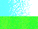

[Open in the playground →](https://clarity.clarklavery.com/#landscape/MedianThreshold)

```js
import { MedianThreshold } from '@calrk/clarity';

new MedianThreshold();
```

_No options._

### ValueThreshold

Two-tone threshold at a given value, or one derived from the image.

**Makes black & white**

 

[Open in the playground →](https://clarity.clarklavery.com/#landscape/ValueThreshold,threshold=120)

```js
import { ValueThreshold } from '@calrk/clarity';

new ValueThreshold({ threshold: 120 });
```

| Property | Type | Range | Default | |
|---|---|---|---|---|
| `inverted` | bool | true / false | `false` | Light the pixels below the threshold instead of those above it. |
| `threshold` | int | 0–255, or empty for Auto | _Auto_ | Auto splits the frame at the midpoint of its own range. |
| `channel` | select | `grey` · `red` · `green` · `blue` | `grey` | Which channel to read. Grey is Rec. 601 luma of all three. |

## Salience

### EdgeDetector

Highlights edges with a 3x3 kernel, or a fast two-sample difference.

 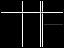

[Open in the playground →](https://clarity.clarklavery.com/#books/EdgeDetector)

```js
import { EdgeDetector } from '@calrk/clarity';

new EdgeDetector();
```

| Property | Type | Range | Default | |
|---|---|---|---|---|
| `fast` | bool | true / false | `false` | Two-sample difference instead of the 3x3 kernel. |
| `channel` | select | `grey` · `red` · `green` · `blue` | `grey` | Which channel to read. Grey is Rec. 601 luma of all three. |

### MotionDetector

Absolute difference between the current frame and one N frames back.

**Needs motion**

 

[Open in the playground →](https://clarity.clarklavery.com/#crystal/MotionDetector)

```js
import { MotionDetector } from '@calrk/clarity';

new MotionDetector({ frameCount: 1 });
```

| Property | Type | Range | Default | |
|---|---|---|---|---|
| `frameCount` | int | 1–24 | `1` | How many frames back to compare against. |
| `channel` | select | `grey` · `red` · `green` · `blue` | `grey` | Which channel to read. Grey is Rec. 601 luma of all three. |

### ShotDetector

Marks the frame where a cut happened, by how much of the picture changed at once.

**Needs motion**

 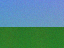

[Open in the playground →](https://clarity.clarklavery.com/#crystal/ShotDetector)

```js
import { ShotDetector } from '@calrk/clarity';

new ShotDetector();
```

| Property | Type | Range | Default | |
|---|---|---|---|---|
| `threshold` | float | 1–128 | `24` | Mean channel change across the frame that counts as a cut. Lower catches dissolves and camera shake too. |

### SkinDetector

Thresholds YCbCr into a binary skin/not-skin mask.

**Makes black & white**

 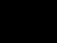

[Open in the playground →](https://clarity.clarklavery.com/#face/SkinDetector)

```js
import { SkinDetector } from '@calrk/clarity';

new SkinDetector();
```

_No options._

## Transform

### ChromaticAberration

Displaces the R and G channels in opposite directions.

 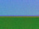

[Open in the playground →](https://clarity.clarklavery.com/#landscape/ChromaticAberration,xdistance=4,ydistance=2,fixed=true)

```js
import { ChromaticAberration } from '@calrk/clarity';

new ChromaticAberration({ xdistance: 4, ydistance: 2, fixed: true });
```

| Property | Type | Range | Default | |
|---|---|---|---|---|
| `xdistance` | int | -100–100 | `8` | How far red and blue pull apart horizontally, in pixels at the frame edge. |
| `ydistance` | int | -100–100 | `0` | The same displacement vertically. Green never moves. |
| `fixed` | bool | true / false | `false` | Displace uniformly rather than growing toward the edges. |

### FishEye

Bows the image outward like a lens, or pinches it inward.

 

[Open in the playground →](https://clarity.clarklavery.com/#landscape/FishEye)

```js
import { FishEye } from '@calrk/clarity';

new FishEye();
```

| Property | Type | Range | Default | |
|---|---|---|---|---|
| `amount` | float | -1–1 | `0.3` | Above zero bows the image outward like a lens or a CRT face; below zero pinches it inward. |
| `zoom` | float | 0.5–2 | `1` | Scales the frame before distorting, to push the black corners back off-screen. |

### Mirror

Flips the image horizontally, vertically, or both.

 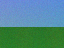

[Open in the playground →](https://clarity.clarklavery.com/#landscape/Mirror)

```js
import { Mirror } from '@calrk/clarity';

new Mirror({ horizontal: true });
```

| Property | Type | Range | Default | |
|---|---|---|---|---|
| `horizontal` | bool | true / false | `true` | Flip left to right. |
| `vertical` | bool | true / false | `false` | Flip top to bottom. With both set the image is rotated 180 degrees. |

### Rotator

Rotates in 90 degree steps.

 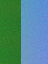

[Open in the playground →](https://clarity.clarklavery.com/#landscape/Rotator)

```js
import { Rotator } from '@calrk/clarity';

new Rotator({ turns: 1 });
```

| Property | Type | Range | Default | |
|---|---|---|---|---|
| `turns` | int | 0–3 | `1` | Quarter turns clockwise. |
| `fit` | select | `resize` · `crop` | `resize` | What a quarter turn does to a non-square frame. |

### Tiler

Mirrors the image into four quadrants, so opposite edges match and the result tiles seamlessly.

 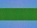

[Open in the playground →](https://clarity.clarklavery.com/#landscape/Tiler)

```js
import { Tiler } from '@calrk/clarity';

new Tiler();
```

_No options._

### Translator

Shifts the image by a percentage, wrapping at the edges.

 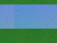

[Open in the playground →](https://clarity.clarklavery.com/#landscape/Translator,horizontal=0.25,vertical=0.1)

```js
import { Translator } from '@calrk/clarity';

new Translator({ horizontal: 0.25, vertical: 0.1 });
```

| Property | Type | Range | Default | |
|---|---|---|---|---|
| `horizontal` | float | -1–1 | `0.5` | Fraction of the frame width, wrapping at the edges. |
| `vertical` | float | -1–1 | `0.5` | Fraction of the frame height, wrapping at the edges. |

### Wave

Displaces pixels along a sine function.

 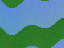

[Open in the playground →](https://clarity.clarklavery.com/#landscape/Wave,axis=vertical,frequency=12,amplitude=5)

```js
import { Wave } from '@calrk/clarity';

new Wave({ axis: "vertical", amplitude: 5, frequency: 12 });
```

| Property | Type | Range | Default | |
|---|---|---|---|---|
| `axis` | select | `horizontal` · `vertical` · `both` | `horizontal` | Which way the pixels travel. Both together give a swimming effect. |
| `speed` | int | -10–10 | `1` | Cycles per second. Negative runs the wave backwards, 0 freezes it. |
| `frequency` | float | 1–100 | `10` | Divides the coordinate, so a higher number means longer, gentler waves. |
| `amplitude` | float | 1–100 | `10` | How far a pixel travels at the crest, in pixels. |

## Height Map

### Contourer

Bands a height map into discrete contour steps.

**Wants a height map**

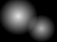 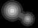

[Open in the playground →](https://clarity.clarklavery.com/#heightmap/Contourer,contours=6)

```js
import { Contourer } from '@calrk/clarity';

new Contourer({ contours: 6 });
```

| Property | Type | Range | Default | |
|---|---|---|---|---|
| `contours` | int | 1–20 | `10` | How many height bands to split the map into. |

### NormalFlip

Flips or swaps the X/Y axes of a normal map.

**Wants a normal map**

 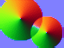

[Open in the playground →](https://clarity.clarklavery.com/#heightmap/NormalGenerator,intensity=1/NormalFlip,red=true,swap=true)

```js
import { NormalFlip } from '@calrk/clarity';

new NormalFlip({ red: true, swap: true });
```

| Property | Type | Range | Default | |
|---|---|---|---|---|
| `red` | bool | true / false | `false` | Negates the X component, in the red channel. Use it when lighting comes out mirrored left to right. |
| `green` | bool | true / false | `false` | Negates the Y component, in the green channel. This is the OpenGL/DirectX normal map difference. |
| `swap` | bool | true / false | `false` | Exchanges the X and Y components, for a map generated with the axes transposed. |

### NormalGenerator

Derives a tangent-space normal map from a height map.

**Wants a height map**

 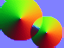

[Open in the playground →](https://clarity.clarklavery.com/#heightmap/NormalGenerator,intensity=1)

```js
import { NormalGenerator } from '@calrk/clarity';

new NormalGenerator({ intensity: 1 });
```

| Property | Type | Range | Default | |
|---|---|---|---|---|
| `intensity` | float | 0–3 | `0.5` | How much the height differences tilt the normal. |

### NormalIntensity

Strengthens or weakens the X/Y tilt of an existing normal map.

**Wants a normal map**

 

[Open in the playground →](https://clarity.clarklavery.com/#heightmap/NormalGenerator,intensity=1/NormalIntensity,intensity=1.5)

```js
import { NormalIntensity } from '@calrk/clarity';

new NormalIntensity({ intensity: 1.5 });
```

| Property | Type | Range | Default | |
|---|---|---|---|---|
| `intensity` | float | 0–2 | `0.5` | Below 1 flattens the normal, above 1 exaggerates it. |

## Starters

### Cloud

Fills the frame with tinted value-noise clouds.

**Starter**

 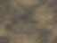

[Open in the playground →](https://clarity.clarklavery.com/#blank/Cloud,green=200,blue=120,iterations=3)

```js
import { Cloud } from '@calrk/clarity';

new Cloud({ red: 255, green: 200, blue: 120, iterations: 3, initialSize: 4 });
```

| Property | Type | Range | Default | |
|---|---|---|---|---|
| `red` | int | 0–255 | `255` | Scales the noise into the red channel. All three at 255 gives grey cloud. |
| `green` | int | 0–255 | `255` | Scales the noise into the green channel. |
| `blue` | int | 0–255 | `255` | Scales the noise into the blue channel. |
| `opaque` | bool | true / false | `true` | Off derives alpha from the colour, for use as a texture mask. |
| `linear` | bool | true / false | `false` | Skip the fade curve on the cell blend. Cheaper, and it makes the lattice edges visible. |
| `fold` | select | `none` · `ridged` · `billow` | `none` | Folds each octave about zero. Ridged gives sharp crests over broad basins - terrain rather than fog; billow gives puffy cells with dark seams. |
| `persistence` | float | 0.1–0.9, or empty for Harmonic | `0.5` | How much quieter each octave is than the last. Lower is smoother; 0.5 is standard fBm. Harmonic is the original falloff, kept for compatibility - it also darkens the frame the more octaves you ask for. |
| `iterations` | int | 1–10 | `4` | Octaves of value noise. |
| `initialSize` | int | 1–16 | `4` | Grid size of the coarsest octave. |

### FillHSV

Fills the frame with one colour, specified in HSV.

**Starter**

 

[Open in the playground →](https://clarity.clarklavery.com/#blank/FillHSV,hue=200,saturation=0.8,value=0.9)

```js
import { FillHSV } from '@calrk/clarity';

new FillHSV({ hue: 200, saturation: 0.8, value: 0.9 });
```

| Property | Type | Range | Default | |
|---|---|---|---|---|
| `hue` | float | 0–360 | `0` | Position on the colour wheel, in degrees. |
| `saturation` | float | 0–1 | `0` | How much colour. 0 is grey. |
| `value` | float | 0–1 | `0` | Brightness. 0 is black. |

### FillRGB

Fills the frame with one colour, specified in RGB.

**Starter**

 

[Open in the playground →](https://clarity.clarklavery.com/#blank/FillRGB,red=200,green=80,blue=40)

```js
import { FillRGB } from '@calrk/clarity';

new FillRGB({ red: 200, green: 80, blue: 40 });
```

| Property | Type | Range | Default | |
|---|---|---|---|---|
| `red` | int | 0–255 | `0` | Red channel of the fill colour. |
| `green` | int | 0–255 | `0` | Green channel of the fill colour. |
| `blue` | int | 0–255 | `0` | Blue channel of the fill colour. |

### Gradient

Fills the frame with a linear or radial grey ramp - the mask primitive for fading anything.

**Starter**

 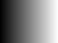

[Open in the playground →](https://clarity.clarklavery.com/#blank/Gradient)

```js
import { Gradient } from '@calrk/clarity';

new Gradient();
```

| Property | Type | Range | Default | |
|---|---|---|---|---|
| `shape` | select | `linear` · `radial` | `linear` | A straight ramp, or one radiating from the centre. |
| `angle` | int | 0–360 | `0` | Direction of a linear ramp, in degrees. 0 runs left to right. Ignored when radial. |
| `start` | int | 0–255 | `0` | Value at the beginning of the ramp, or at the centre when radial. |
| `end` | int | 0–255 | `255` | Value at the end of the ramp, or at the edge when radial. |

### Voronoi

Fills the frame with cellular noise - blobs, cracked seams, or flat stone cells.

**Starter**

 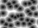

[Open in the playground →](https://clarity.clarklavery.com/#blank/Voronoi,cells=6)

```js
import { Voronoi } from '@calrk/clarity';

new Voronoi({ cells: 6 });
```

| Property | Type | Range | Default | |
|---|---|---|---|---|
| `cells` | int | 2–64 | `8` | How many cells across the frame. Rows are derived from the aspect so the cells stay square. |
| `mode` | select | `distance` · `borders` · `cells` | `distance` | Three textures from one distance field. |

## Dual Input

### Add

Adds the second image to the first, clamping at white.

**Two inputs**

 

[Open in the playground →](https://clarity.clarklavery.com/#landscape/Add)

```js
import { Add } from '@calrk/clarity';

new Add();
```

_No options._

### Subtract

Subtracts the second image from the first, clamping at black.

**Two inputs**

 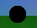

[Open in the playground →](https://clarity.clarklavery.com/#landscape/Subtract)

```js
import { Subtract } from '@calrk/clarity';

new Subtract();
```

_No options._

### Difference

Absolute difference between two images - symmetric, and it keeps the range Subtract clamps away.

**Two inputs**

 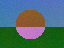

[Open in the playground →](https://clarity.clarklavery.com/#landscape/Difference)

```js
import { Difference } from '@calrk/clarity';

new Difference();
```

_No options._

### Blend

Weighted mix of two images.

**Two inputs**

 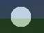

[Open in the playground →](https://clarity.clarklavery.com/#landscape/Blend,ratio=0.35)

```js
import { Blend } from '@calrk/clarity';

new Blend({ ratio: 0.35 });
```

| Property | Type | Range | Default | |
|---|---|---|---|---|
| `ratio` | float | 0–1 | `0.5` | 0 is all of the first image, 1 is all of the second. |

### Mask

Binary stencil - keeps the first image where the mask is light, blacks it out where the mask is dark.

**Two inputs**

 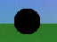

[Open in the playground →](https://clarity.clarklavery.com/#landscape/Mask)

```js
import { Mask } from '@calrk/clarity';

new Mask();
```

| Property | Type | Range | Default | |
|---|---|---|---|---|
| `threshold` | int | 0–255 | `128` | Mask values at or above this keep the first image. |
| `inverted` | bool | true / false | `false` | Keep the dark parts of the mask instead of the light ones. |
| `channel` | select | `grey` · `red` · `green` · `blue` | `grey` | Which channel to read. Grey is Rec. 601 luma of all three. |

### Multiply

Multiplies the two images together, channel by channel.

**Two inputs**

 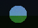

[Open in the playground →](https://clarity.clarklavery.com/#landscape/Multiply)

```js
import { Multiply } from '@calrk/clarity';

new Multiply();
```

_No options._

## Misc

### Brickulate

Overlays a brick/tile grid with bevelled grooves.

 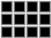

[Open in the playground →](https://clarity.clarklavery.com/#landscape/Brickulate,verticalSegs=3,grooveSize=3)

```js
import { Brickulate } from '@calrk/clarity';

new Brickulate({ horizontalSegs: 4, verticalSegs: 3, grooveSize: 3 });
```

| Property | Type | Range | Default | |
|---|---|---|---|---|
| `horizontalSegs` | int | 1–20 | `4` | How many bricks across the frame. |
| `verticalSegs` | int | 1–20 | `4` | How many bricks down the frame. |
| `grooveSize` | int | 1–20 | `5` | Width of the bevelled mortar line between bricks, in pixels. |
| `offset` | bool | true / false | `false` | Shift alternate rows by half a brick, for a running bond rather than a stacked grid. |

### DifferenceDetector

Compares each frame against the first one it saw.

**Needs motion**

 

[Open in the playground →](https://clarity.clarklavery.com/#crystal/DifferenceDetector)

```js
import { DifferenceDetector } from '@calrk/clarity';

new DifferenceDetector();
```

_No options._

### Ghoster

Onion-skins the last N frames together, weighted towards the newest.

**Needs motion**

 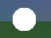

[Open in the playground →](https://clarity.clarklavery.com/#crystal/Ghoster,length=3)

```js
import { Ghoster } from '@calrk/clarity';

new Ghoster({ length: 3 });
```

| Property | Type | Range | Default | |
|---|---|---|---|---|
| `length` | int | 1–30 | `10` | How many frames are onion-skinned together. |

### ScreenBurn

Burns a fading ghost of the brightest thing that has been on screen.

**Needs motion**

 

[Open in the playground →](https://clarity.clarklavery.com/#crystal/ScreenBurn,length=3)

```js
import { ScreenBurn } from '@calrk/clarity';

new ScreenBurn({ length: 3 });
```

| Property | Type | Range | Default | |
|---|---|---|---|---|
| `length` | int | 1–32 | `12` | How many frames the burn remembers. |
| `decay` | float | 0.5–1 | `0.92` | How much dimmer the ghost gets each frame. 1 never fades. |

### Puzzler

Scrambles the image into shuffled tiles.

 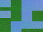

[Open in the playground →](https://clarity.clarklavery.com/#landscape/Puzzler,verticalSegs=3)

```js
import { Puzzler } from '@calrk/clarity';

new Puzzler({ horizontalSegs: 4, verticalSegs: 3 });
```

| Property | Type | Range | Default | |
|---|---|---|---|---|
| `horizontalSegs` | int | 2–16 | `4` | How many tiles across. Changing it reshuffles. |
| `verticalSegs` | int | 2–16 | `4` | How many tiles down. Changing it reshuffles. |

---

_Regenerate with `npm run docs`._
